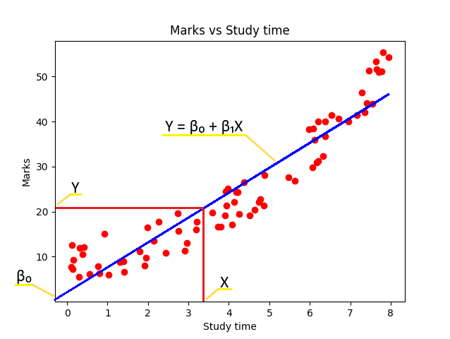

# What is Linear Regression?
Linear regression helps establish a mathematical relationship between a set of variables using a straight line called the regression line. The equation of the regression line tries to best predict a ‘dependent’ variable based on an ‘independent’ variable.

Note, linear regression can be extended to incorporate more than one independent variable. This would be called multiple linear regression. The extension enables the model to consider the collective influence of various factors on the dependent variable, offering a more comprehensive analysis.

Moreover, by introducing polynomial terms or other transformations of the independent variables, linear regression can also accommodate non-linear relationships, thereby enhancing its flexibility in capturing complex patterns.

- Watch this 2 minute video for more clarity → https://youtu.be/CtsRRUddV2s

However, for the purpose of this episode, our scope will be limited to a ‘simple linear regression’ consisting of one dependent variable and one independent variable.

### Case in point

Consider the available data-set of ‘time spent by a student studying’ paired with ‘marks obtained’.

This will be used in our linear regression demo to predict the marks obtained (dependent variable) by a student based on the time spent studying (independent variable).

## Key players
- **Dependent Variable (Y):** The variable you're trying to predict (exam scores). Plotted on the Y-axis in our graph (vertical).
- **Independent Variable (X):** The variable you think influences the dependent variable (hours studied). Plotted on the X-axis in our graph (horizontal).
- **Slope (β₁):** This tells you the direction and steepness of the line. Look at the graph!
- **Positive slope (like in our example):** As X increases (more hours studied), Y increases (higher scores). The line slants upwards.
- **Negative slope:** As X increases, Y decreases (e.g., as medication dosage increases, side effects decrease). The line would slant downwards.
- **Zero slope:** No relationship between X and Y. The line would be horizontal.
- **Intercept (β₀):** The point where the regression line crosses the Y-axis. It represents the predicted value of Y when X is zero. See the graph, where the line crosses the Y-axis.

## The equation behind the line (the magic under the hood)

#### `Y = β₀ + β₁X`

- `Y` = Predicted value of the dependent variable
- `β₀` = Intercept (Y-axis intercept)
- `β₁` = Slope of the line
- `X` = Independent variable

## Finding the best fit line

We don't magically know the perfect slope and intercept. Simple linear regression uses a least squares approach to find the line that minimizes the overall squared difference between the actual Y values (data points) and the predicted Y values from the equation.

#### Important to remember

- Simple linear regression assumes a linear relationship between X and Y. Our graph visualizes this! If the data points scatter randomly without a clear trend, this method might not be suitable.
- It only works with two continuous variables.
- There will always be some error, represented by the residuals (the difference between actual and predicted Y values).

## Further exploration

This is just a taste. As you delve deeper, you'll explore calculating the slope and intercept, assessing the strength of the relationship (R-squared), and dealing with errors.

For now, this should equip you with the essentials of simple linear regression. If you want to dig deeper and learn more about linear regression, go through the resources given at the end and learn more in-depth concepts.

Remember, practice makes one perfect, so grab some data and get regressing!

## Additional Resources

- [Statistics How To - Linear Regression](https://www.statisticshowto.com/)
  - This webpage offers a clear breakdown of linear regression with explanations, formulas, and video tutorials.

- [Khan Academy - Linear Regression](https://www.khanacademy.org/math/statistics-probability/describing-relationships-quantitative-data/more-on-regression/v/regression-line-example)
  - Khan Academy provides a free, interactive course on linear regression with video lectures and practice exercises.

- [StatTrek - Simple Linear Regression](https://stattrek.com/tutorials/regression-tutorial)
  - StatTrek offers a concise explanation of simple linear regression with real-world examples.

- [Towards Data Science - Understanding the Assumptions of Linear Regression](https://towardsdatascience.com/an-introduction-to-linear-regression-for-data-science-9056bbcdf675)
  - This article delves into the essential assumptions required for linear regression analysis.

- [MIT OpenCourseware - Linear Regression](https://ocw.mit.edu/courses/15-071-the-analytics-edge-spring-2017/pages/linear-regression/)
  - MIT OpenCourseware offers lecture notes and materials from a linear regression course at MIT.

- [Coursera - Applied Regression Analysis](https://www.coursera.org/learn/regression-models)
  - This specialization on Coursera provides a comprehensive introduction to regression analysis, including linear regression.

- [Machine Learning Crash Course - Linear Regression with Python](https://scikit-learn.org/stable/modules/generated/sklearn.linear_model.LinearRegression.html)
  - This tutorial guides you through implementing linear regression in Python using the popular scikit-learn library.

- [Stanford University - CS229: Machine Learning](https://web.stanford.edu/class/stats202/notes/Linear-regression/Simple-linear-regression.html)
  - Stanford University's CS229 course offers in-depth lectures on machine learning concepts, including linear regression.

- [Wikipedia - Linear Regression](https://en.wikipedia.org/wiki/Simple_linear_regression)
  - The Wikipedia page on linear regression provides a technical overview of the concept and related mathematical details.

- [Harvard University - Linear Regression in R](https://www.youtube.com/watch?v=DmGLQkUm-4g)
  - This Harvard resource explains linear regression using the R programming language.